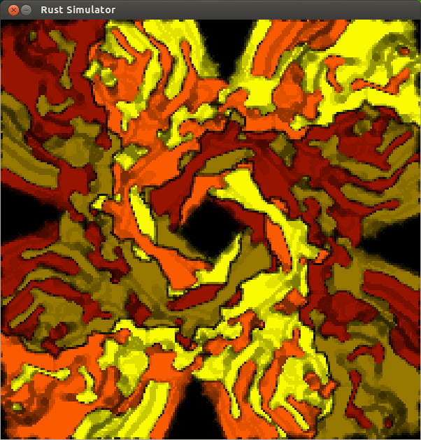

# Rusty Automata

This is an experiment in Rust & cellular automata. [video](http://www.youtube.com/watch?v=lNFOnomruqk)



## Requirements
- libSDL2 development headers (`yum install SDL2-devel` or `apt-get install libsdl2-dev`)
- A recent version of Rust

## To build & run
```
cargo run
```

## Keyboard shortcuts
- d: cycle demos
- p: pause/play
- s: step (when paused)
- t: change theme (dark/light)
- c: change mouse color (the color created when drawing with the mouse)

## Supported Environments
Let's be real, this is a toy experiment; "support" isn't really part of the picture.

Nevertheless, I've compiled this just fine on recent versions of Ubuntu and Fedora.

Let me know if you have questions/comments in the GitHub issues.

## License
Apache version 2
